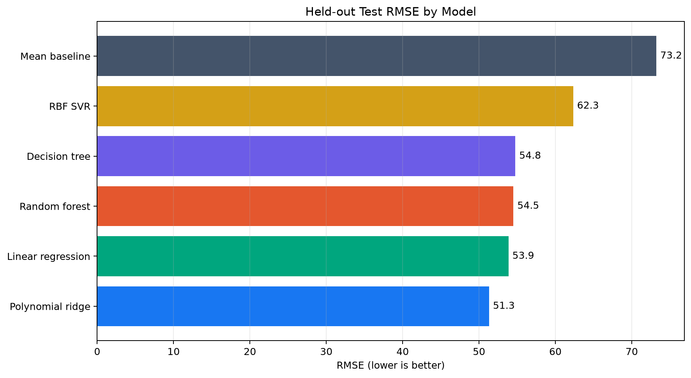
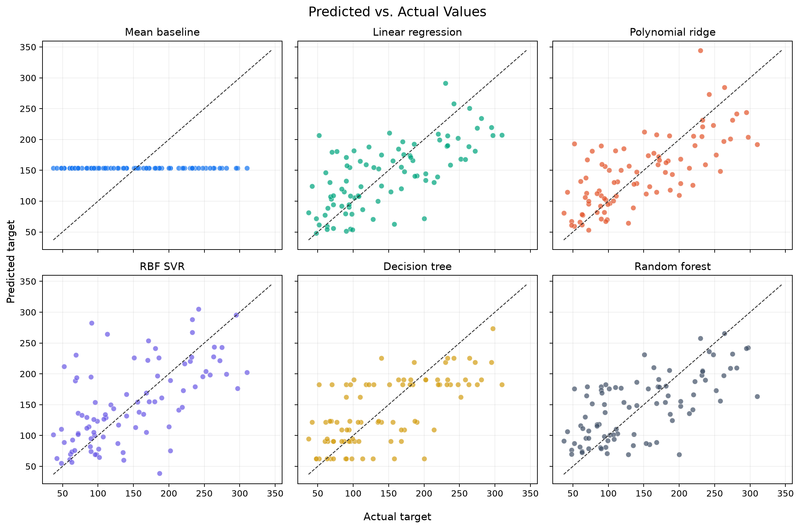
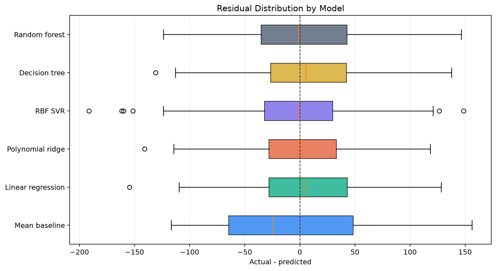

# Regression Model Benchmark

A reproducible benchmark of classical regression algorithms using cross-validation and a held-out test set. The project turns introductory regression exercises into a clean, testable machine learning workflow.

## What This Project Demonstrates

- A mean predictor used as a transparent baseline
- Linear, polynomial, support vector, decision tree, and random forest regression
- Leakage-resistant preprocessing with scikit-learn pipelines
- Five-fold cross-validation plus final evaluation on unseen test data
- MAE, RMSE, and R2 metrics
- Reproducible plots and CSV artifacts
- Automated tests for data, models, metrics, and generated outputs

## Dataset

The benchmark uses scikit-learn's built-in diabetes regression dataset:

- 442 samples
- 10 numeric input features
- A continuous disease-progression target measured one year after baseline

The dataset is included with scikit-learn, so the project runs without downloading external data. It is used only as a machine learning benchmark and is not intended for medical decision-making.

## Models

| Model | Purpose |
| --- | --- |
| Mean baseline | Establishes the minimum useful reference |
| Linear regression | Provides an interpretable linear model |
| Polynomial ridge | Captures second-order relationships with regularization |
| RBF SVR | Models nonlinear relationships after feature and target scaling |
| Decision tree | Provides a bounded-depth nonlinear tree model |
| Random forest | Reduces tree variance through an ensemble |

## Results

The table below is produced with `random_state=42`, a 20% held-out test split, and five-fold cross-validation on the training set.

| Model | CV MAE | CV RMSE | CV R2 | Test MAE | Test RMSE | Test R2 |
| --- | ---: | ---: | ---: | ---: | ---: | ---: |
| Polynomial ridge | 46.706 | 58.600 | 0.417 | **39.867** | **51.314** | **0.503** |
| Linear regression | **45.048** | **55.395** | **0.480** | 42.794 | 53.853 | 0.453 |
| Random forest | 47.951 | 58.347 | 0.421 | 44.251 | 54.505 | 0.439 |
| Decision tree | 52.315 | 65.309 | 0.275 | 43.442 | 54.753 | 0.434 |
| RBF SVR | 51.690 | 67.331 | 0.231 | 46.382 | 62.332 | 0.267 |
| Mean baseline | 66.867 | 78.134 | -0.027 | 64.006 | 73.222 | -0.012 |

Polynomial ridge achieved the best held-out result in this run. Linear regression had the strongest average cross-validation scores, which is a useful reminder that a single test split should not be treated as definitive proof that one model is universally superior.







## Project Structure

```text
.
|-- src/regression_benchmark/
|   |-- benchmark.py
|   |-- cli.py
|   `-- __main__.py
|-- tests/test_benchmark.py
|-- results/
|-- pyproject.toml
|-- requirements.txt
`-- README.md
```

## Quick Start

```bash
python -m venv .venv
```

Windows PowerShell:

```powershell
.\.venv\Scripts\Activate.ps1
python -m pip install -e ".[dev]"
regression-benchmark --output-dir results
pytest
```

macOS or Linux:

```bash
source .venv/bin/activate
python -m pip install -e ".[dev]"
regression-benchmark --output-dir results
pytest
```

You can change the evaluation settings from the command line:

```bash
regression-benchmark --test-size 0.2 --cv-splits 5 --random-state 42
```

## Evaluation Design

The data is split once into training and test sets. Model comparison uses shuffled five-fold cross-validation on the training set only. Each selected model is then fitted on the full training set and evaluated once on the held-out test set. Preprocessing steps live inside model pipelines so they are fitted separately inside every cross-validation fold.

## Author

Muhammet Yusuf Polat  
Software Engineering Student | AI & Machine Learning | Python
